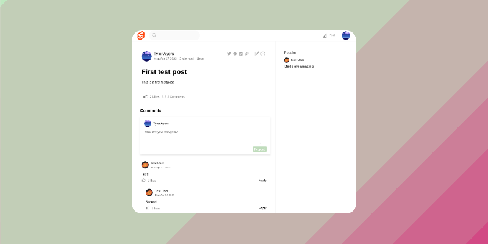

# SVONT - Svelte Content Collaboration

Svont (**sv**elte+c**ont**ent) is a simple, feature-rich Content Collaboration System (CCS) using Svelte and a serverless / NODB stack (think serverless Wordpress with Svelte). You can deploy Svont either in an all-in-one container, or distributed across static hosting and a backend service.

## Live Demo 🎉

Check out a first **[test deployment](https://svont-ccs-test.web.app/)** (using the [Google Cloud Run](https://cloud.google.com/run) serverless platform, [Google Cloud Storage](https://cloud.google.com/storage) for storage, and [Firebase hosting](https://firebase.google.com/docs/hosting) for static hosting).

You can browse some test posts, as well as sign in with a Google account and post / like / comment.

## Why another CMS/CCS?

Because most CMS's require a database like MySQL or Postgresql, and so are heavier and more resource intensive to run. Svont aims to be extremely _svelte_, like the framework itself, and run very efficiently using cloud serverless platforms and static hosting services.

This project was initially built for the SvelteSociety Hackathon 2023 (Feb 2023 - April 2023).

## Why Svelte?

Many frameworks were tested for this project, including solid, react, preact, vue, etc... You can find the tests in the clients/test-clients directory, but long-story-short svelte won out on capabilities, size & speed (preact was the other finalist). A blog article is coming with more detailed results of the comparison.

The components used were developed in this [separate component project](https://github.com/tyayers/svelte-content-widgets), also showing how amazingly portable Svelte components are.

## Which use-cases is Svont good for?

Svont is ideal for use-cases such as:

1. Team collaboration site, where users can post content updates with document attachments, get likes, leave comments, etc... Think Sharepoint or Confluence, but simpler and more lightweight and less resource intensive to run (but still with the most important features).
2. Public blog with content posts, search, and the possibility for registered users to like and comment on content. Think Wordpress blogs, with both public and private registered user content & interaction.
3. Micro social platforms to quickly and easily host content and users for a specific topic, with social features like likes and comments.

## Currently supported features

These features are currently supported:

- User registration and sign-in (currently using [Firebase Auth](https://firebase.google.com/docs/auth))
- Content posting, editing and deleting (currently using [CKEditor](https://ckeditor.com/) as content editor)
- Content file attachments
- Content likes and comments
- Built-in theme inspired by Medium.com
- Full-text search of content (using the [bleve](https://github.com/blevesearch/bleve) framework, similar to Elasticsearch but embedded/lightweight)

## Architecture

Both server and client are built to support plugins to different data providers.

### Server

The server is currently implemented in [GOLANG](https://go.dev/), and supports plugins to these backends for storing data.

- Local drive storage (run on a server, saves posts and index data locally)
- [Google Cloud Storage](https://cloud.google.com/storage) - saves posts, attachments and indexes to GCS, ideal for serverless deployments
- In the future, it would be cool to support further storage providers such as AWS S3, Google Drive, etc..

### Client

The client is implemented using [SvelteKit](https://kit.svelte.dev/) in [TypeScript](https://www.typescriptlang.org/), and supports plugins to these backend services for retrieving data:

- LocalStorage in the browser (useful for testing without a backend, you can create, view and edit posts just in your browser storage)
- The server above, accessed via a REST API.
- In the future it could be cool to support other headless CMS systems, potentially..

## Bugs

These bugs are present in the current version:

- You can like a post as many times as you like, also as the author.
- Large images in post overrun the frame
- Social sharing buttons don't do anything
- Lots of other misc stuff, this is a first functional version (feel free to add issues!)

## Roadmap

Here is the roadmap of planned features:

- Post overview pagination - currently it's a single long list of posts, pagniation needed (prio 1)
- RSS feed support - automatically generate and publish RSS feed of content
- Theme support - admins can choose from different themes to use, also with dark mode support
  - Material Design theme
  - Bootstrap (Twitter) theme
  - Others?
- Admin console to manage site configuration
- Email notification support - get notified by email for new comment, likes, follow specific users, etc..
- User statistics and overview - have a view per user of posts by user, comments, other data, possibility to follow, etc..
